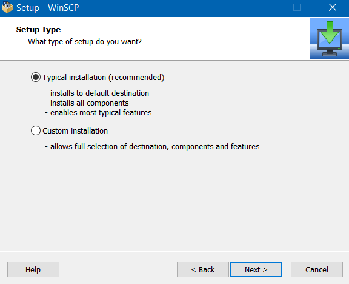

Access instructions
======
---
# Access within UW network

Mounting the NAS as a network drive is the recommended method to access BAILnas.
Please follow the instructions below to mount BAILnas as network drive:

## Windows

1. Press <kbd>Win</kbd>+<kbd>R</kbd> and type `cmd`, then <kbd>Enter</kbd>
2. In command prompt, type `net use n: \\nas.bail.bioeng.washington.edu\NAS`, then <kbd>Enter</kbd>
3. Input your username and password when prompted. Note that your password may not show while you are typing.
4. To access BAILnas/Data, use this command instead: `net use t: \\nas.bail.bioeng.washington.edu\Data`

**Shortcut for windows**

* Alternatively, if you prefer not to use windows commands, please download and run the shortcut executables below:

    click to download: <a href="https://uwbail.github.io/BAILnas/res/connect-NAS+Data.bat" download>connect-NAS+Data.bat</a>

    note: if this executable is blocked by Windows Defender/Smartscreen etc., just click "more info" and the option for "run anyway" will appear.

## Mac OS 

1. From Mac OS Finder, press <kbd>⌘</kbd>+<kbd>K</kbd> to bring up the ‘Connect to Server’ window.
2. Enter the path to the network drive:  `smb://nas.bail.bioeng.washington.edu/NAS`.
3. Enter your username and password, then click "OK".
4. The NAS drive will appear as "NAS" on your desktop and Finder.

## Linux / Unix

If you're a Linux/Unix user you will most likely get bored reading the instructions. Skipping. :-D

---

# Access from anywhere else

## Windows

Below is the instructions for using a software "WinSCP" to access NAS with SFTP protocol.

1. Click [here to download WinSCP](https://winscp.net/eng/download.php).

2. Install WinSCP with "typical installation" option.

    

3. Select "Explorer" interface style

    

4. Enter you logon details as below, then click "save"

    

5. You can save a shortcut to desktop in the next window

    

6. Click "yes" to accept server key

    

7. Now you have access to NAS folder. To navigate to other folders (e.g. BAILnas/Data), you may need to click on upper level directory in order to refresh.

    

## Mac OS

Download [FileZilla](https://filezilla-project.org/download.php?platform=osx) and follow similar setup procedure as "WinSCP" in windows.

type `sftp://nas.bail.bioeng.washington.edu` ,then your user name, password, and port `2221`

then click `quickconnect`.

For the first time  you connect, you need to accept the key of the host, then click OK.

Note: By default, FileZilla will terminate connection after 20 seconds of inactivity. You can disable auto-termination in settings by setting the timeout value to "0".

## Mobile devices

### Android

Download Solid Explorer (or any alternative remote file explorer),

use the following configurations:

### iOS

Use [FTPManager](https://itunes.apple.com/us/app/ftpmanager-ftp-sftp-client/id525959186?mt=8) :

fill in the highlighted fields below. hostname is "nas.bail.bioeng.washington.edu"

